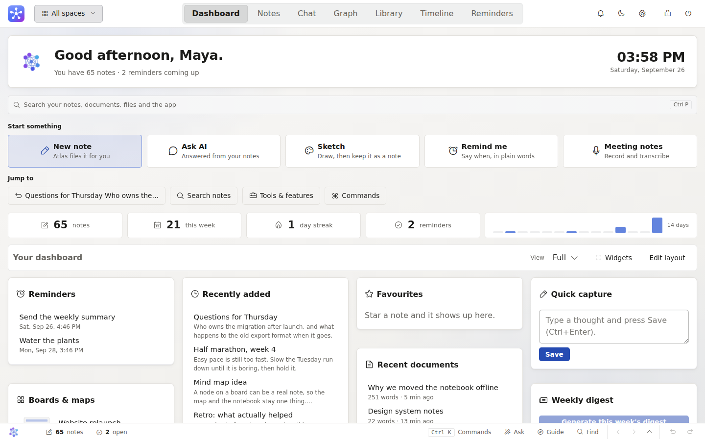
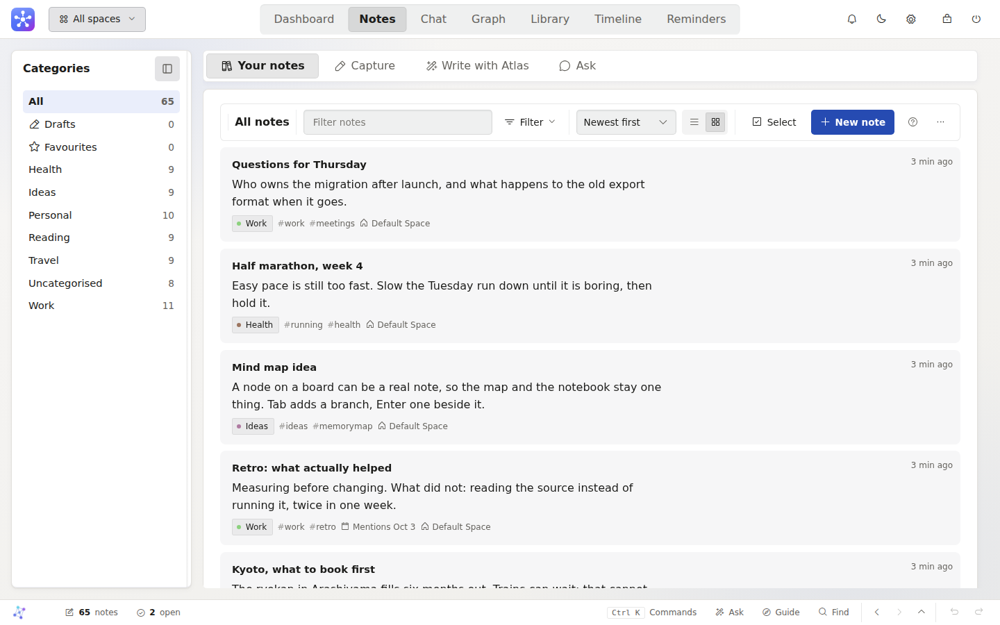
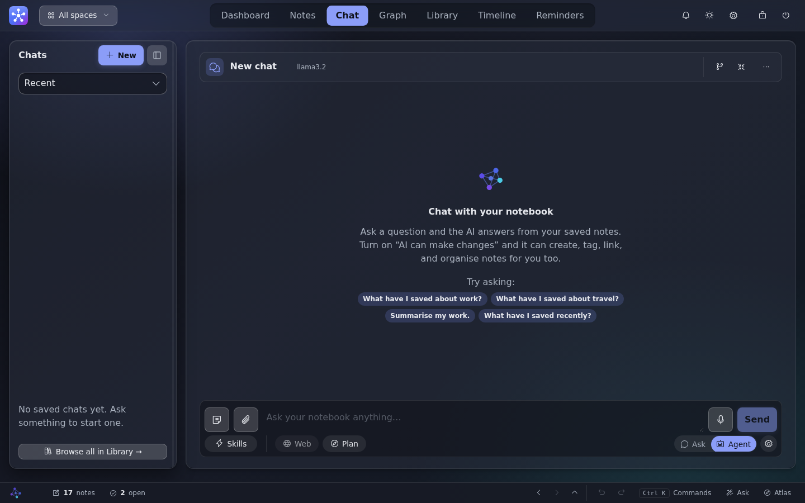
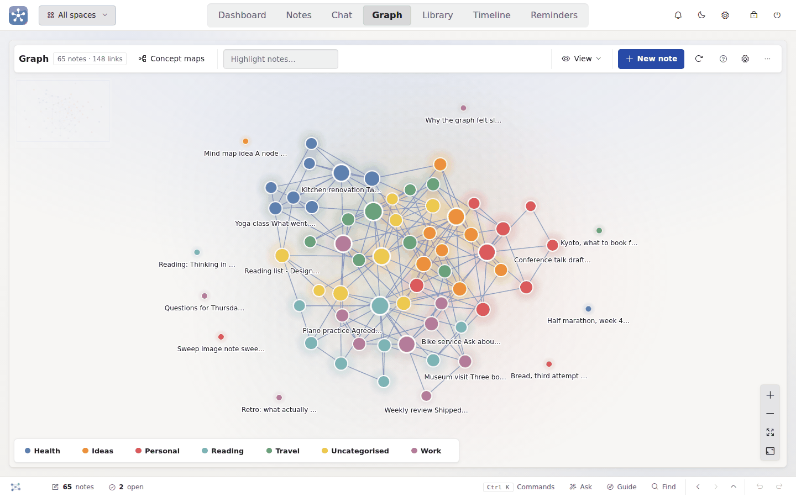
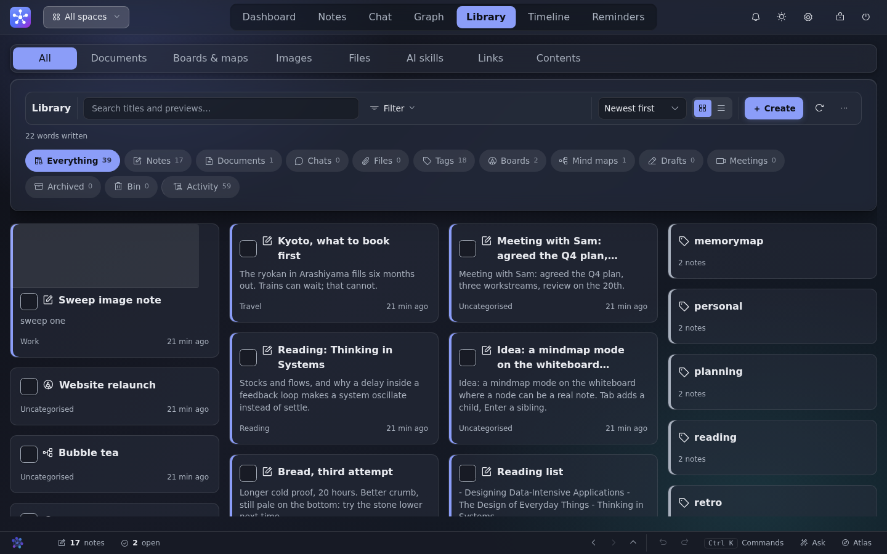
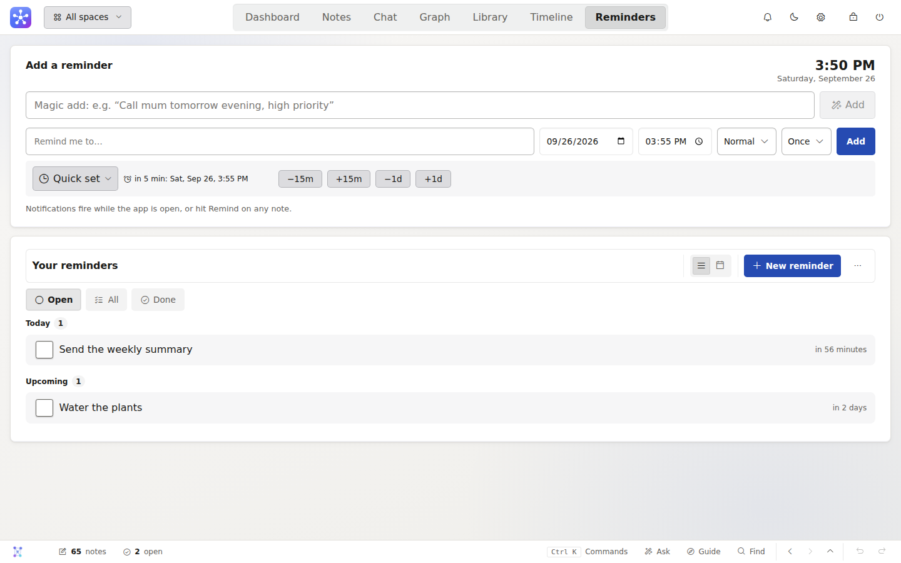

<div align="center">


# MemoryMap AI

**Your thoughts, mapped by a local AI. 100% offline, on your machine.**

[](https://github.com/Braydenh563/MemoryMap-AI/actions/workflows/ci.yml)
[](https://github.com/Braydenh563/MemoryMap-AI/actions/workflows/codeql.yml)
[](pyproject.toml)
[](LICENSE)

</div>

---

Note apps make *you* do the filing. MemoryMap AI doesn't.

Type a thought and a local AI files it. Later, ask a question in plain
English and get back **both** a conversational answer **and** the raw notes
it came from — so you can check it.

```
capture text  →  AI files it  →  ask a question  →  answer + the notes behind it
```

Everything runs on your own computer. No account, no cloud, no telemetry.
Your notes are a SQLite file in a folder you control.

**Getting started** — [download the Windows installer](#windows-installer)
or [run the launcher script](docs/INSTALL.md) — no terminal experience
needed either way.

<p align="center">
  
</p>

<details>
<summary><b>More screenshots</b> — Notes, Chat, Graph, Library, Timeline, Reminders</summary>
<br>

<table>
<tr>
<td width="50%">

<p align="center"><sub><b>Notes</b> — captured, categorised, and linked to what they relate to</sub></p>
</td>
<td width="50%">

<p align="center"><sub><b>Chat</b> — an answer plus the tool-use steps and notes behind it, not a black box</sub></p>
</td>
</tr>
<tr>
<td width="50%">

<p align="center"><sub><b>Graph</b> — your notes as a map, coloured by category, linked by meaning</sub></p>
</td>
<td width="50%">

<p align="center"><sub><b>Library</b> — notes, documents, chats and files, all in one place</sub></p>
</td>
</tr>
<tr>
<td width="50%">

<p align="center"><sub><b>Timeline</b> — every note on a time axis, banded by category</sub></p>
</td>
<td width="50%">

<p align="center"><sub><b>Reminders</b> — due dates linked back to the note they came from</sub></p>
</td>
</tr>
</table>

</details>

## Contents

- [Why this exists](#why-this-exists)
- [What's in it](#whats-in-it)
- [Windows installer](#windows-installer)
- [Get started another way](#get-started-another-way)
- [Your data and privacy](#your-data-and-privacy)
- [Troubleshooting](#troubleshooting)
- [Developing](#developing)
- [Where it's up to](#where-its-up-to)
- [Full documentation](#full-documentation)
- [License](#license)

## Why this exists

- **Just capture.** Type a thought; a local AI files it into the right
  category — matched by meaning, decided by the chat model, or your own
  choice in guided mode. It tells you *which*, and flags the ones it wasn't
  sure about.
- **Ask, don't dig.** Plain-English questions return an answer *and* the
  notes that back it up, side by side. You are never asked to trust a
  summary you can't check.
- **It's genuinely yours.** No account, no cloud, no telemetry. Plain
  SQLite in a folder you choose, with JSON/CSV/Markdown export built in.
  The server binds to localhost and never phones home.
- **It works when the AI doesn't.** No Ollama running? Notes are filed as
  `Uncategorised`, search falls back to keywords, and a dot in the header
  says what the AI is doing. **Saving a note never fails.**

## What's in it

Seven tabs, all offline:

- **Dashboard** — capture streak, at-a-glance stats, an AI digest of your
  week, and a layout you can rearrange
- **Notes** — capture, browse and ask, with auto-filing, tags, threads,
  private notes, a recycle bin, and **extract notes** (turn a block of free
  text into AI-drafted, auto-linked notes)
- **Chat** — a saved, resumable conversation. **Agent mode** gives it
  ~50 tools to search, link, organise and act on your notes, with
  destructive actions always confirmed
- **Graph** — your notes as a force-directed map and a knowledge graph the
  AI can walk, labelled with *how* two notes connect
- **Library** — everything you've made in one place: notes, documents,
  chats, files, tags, the bin and the activity log. Also where the
  long-form **document editor** and the **whiteboard** (freehand sketches +
  note cards on a pannable canvas) open from
- **Timeline** — every note on a time axis, banded by category or tag
- **Reminders** — due dates with priority, repeats and snooze, or just say
  "call mum tomorrow evening" and let the AI schedule it

Plus a status bar, command palette (`Ctrl`/`Cmd`+`K`), a sketch pad, local
Whisper dictation, read-aloud, opt-in web search, 12 themes over 8 colour
palettes, 16 built-in skills, and daily local backups.

Two things run on their own once you switch them on — both **off by
default**, because both act without being asked:

- **Search by meaning** (✨ Semantic) — matches ideas, not words.
- **The background librarian** — tags, links and flags duplicates on an
  interval you choose. Never deletes, never asks a question it can't
  answer, skips itself on battery power.

**Settings → Packages** installs the packages behind optional features —
dictation, the desktop window, search-by-meaning — nothing there is needed
for the core app to work.

## Windows installer

The simplest way in, no terminal or Python install required: download the
latest `MemoryMap-AI-Setup-*.exe` from
[Releases](https://github.com/Braydenh563/MemoryMap-AI/releases) and run
it. Full walkthrough — including the SmartScreen warning you'll see and
how the desktop app runs without a terminal window — in
**[`docs/INSTALL.md`](docs/INSTALL.md#windows-installer)**.

## Get started another way

- **macOS / Linux / build it yourself on Windows:** the launcher script —
  `./start.sh` or `start.bat` — installs everything and opens the app in
  one command. Full step-by-step (including for a first-ever terminal
  user): **[`docs/INSTALL.md`](docs/INSTALL.md)**.
- **Prefer to manage the virtual environment yourself?** Manual setup,
  updating and uninstalling are all in the same guide.
- **Adding the AI:** install [Ollama](https://ollama.com) and pull a model
  — which one depends on your machine's RAM. Full recommendations, a
  runs-on-anything table, and using LM Studio/llama.cpp/Jan/vLLM instead:
  **[`docs/MODELS.md`](docs/MODELS.md)**.

## Your data and privacy

Everything lives in the `data/` folder (gitignored) — `memorymap.db` (your
notes), `preferences.json`, `uploads/` (attachments and sketches), and
`backups/` (daily local snapshots). Point `MEMORYMAP_DATA_DIR` somewhere
else to relocate all of it.

**Nothing leaves your machine unless you explicitly ask it to.** The AI is
locked to your own network by default, web search (off by default) sends
only your search words and never your notes, and private notes are
encrypted at rest with a key your password derives. The full model — what
touches the network and when, session expiry, the CSRF/CSP protections, and
what to do if you forget your password — is in
**[`docs/PRIVACY.md`](docs/PRIVACY.md)**.

To report a security vulnerability, see **[`SECURITY.md`](SECURITY.md)**.

## Troubleshooting

The most common snags — a Windows torch DLL error, SearXNG not starting,
what the AI-status dot's colours mean, and how to pull logs for a bug
report — are answered in **[`docs/TROUBLESHOOTING.md`](docs/TROUBLESHOOTING.md)**.

## Developing

```
pytest                       # ~1,900 tests, a few minutes
ruff check .                 # what CI lints with
node --check frontend/app.js # the frontend is one plain-JS file
```

Tests use a throwaway database and fake every AI call, so they run fast and
fully offline — no GPU, no models, no network.

**They also cannot see the interface.** Drive the app in a browser before
believing a frontend change works —
[`docs/ARCHITECTURE.md`](docs/ARCHITECTURE.md) §10 says how, and lists the
layout traps that keep catching people out.

[`CONTRIBUTING.md`](CONTRIBUTING.md) covers setup and opening a PR.

```
src/memorymap/
├── __main__.py       # entry point: python -m memorymap [--desktop]
├── core/             # config, database + auto-migrator, singletons, backup, logs
├── entry/            # create/read/soft-delete notes + the audit log
├── ai/                # ollama client, janitor, librarian, agent, tools, embeddings, voice
├── search/            # keyword + semantic search, opt-in web search, SearXNG
└── api/               # FastAPI app + routers, one per feature area
frontend/              # vanilla HTML/CSS/JS + PWA - no framework, no build step
tests/                 # pytest; every AI call faked
docs/                  # ARCHITECTURE.md, DESIGN.md, ROADMAP.md + roadmap/
```

## Where it's up to

The core app — capture, chat, the graph, documents, private notes, themes,
the whiteboard, desktop packaging — is built and stable; **1,900+ tests**
stay green on every push. What changed most recently, wave by wave, is in
[`CHANGELOG.md`](CHANGELOG.md). What's still open, ranked with the
reasoning behind each item, is [`docs/ROADMAP.md`](docs/ROADMAP.md) — kept
current every session rather than periodically reconciled with this file.

## Full documentation

| Document | What's in it |
| --- | --- |
| [`docs/INSTALL.md`](docs/INSTALL.md) | The Windows installer, the launcher script, manual setup, updating and uninstalling |
| [`docs/MODELS.md`](docs/MODELS.md) | Which AI model to pick for your machine, and using a backend other than Ollama |
| [`docs/PRIVACY.md`](docs/PRIVACY.md) | What touches the network and when, private-note encryption, session security |
| [`docs/TROUBLESHOOTING.md`](docs/TROUBLESHOOTING.md) | Common problems and their fixes |
| [`docs/ARCHITECTURE.md`](docs/ARCHITECTURE.md) | The whole project explained: design principles, request lifecycle, data model, the AI stack, and where to look to change any given thing |
| [`docs/ROADMAP.md`](docs/ROADMAP.md) | What's outstanding, in order, and *why* each thing matters. Split into `roadmap/BACKLOG.md`, `roadmap/ANALYSIS.md` and `roadmap/HISTORY.md` |
| [`docs/DESIGN.md`](docs/DESIGN.md) | The design system — tokens, scales, and the rules new features are written against |
| [`CONTRIBUTING.md`](CONTRIBUTING.md) | Setup, tests, opening a PR |
| [`SECURITY.md`](SECURITY.md) | How to report a vulnerability |
| [`CHANGELOG.md`](CHANGELOG.md) | What changed, wave by wave |

**Operational decisions worth knowing:** migrations are additive (no
Alembic yet — deliberately deferred until a column rename is genuinely
needed); SQLCipher is deferred too (your OS's disk encryption covers a
single-user local file, and private notes are already encrypted
individually); CI lints with ruff and runs the full suite on Python 3.11–3.13
on every push, needing no GPU, models or network beyond pip.

## License

Released under the
[GNU Affero General Public License v3.0](https://github.com/Braydenh563/MemoryMap-AI/blob/main/LICENSE).

In short: you may use, study, modify and share this, and anything you build
on it must stay under the same licence — **including if you run a modified
copy as a network service.** That last clause is the AGPL's whole point and
the reason it was chosen here: MemoryMap is a local-first app, and the
licence is what stops a modified, closed version of it being offered back
to people as a hosted product.
