<div align="center">

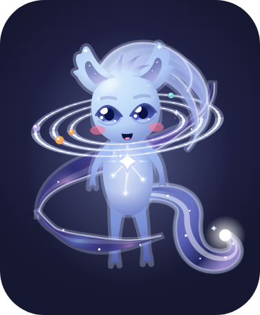

# MemoryMap AI

**A notebook that files itself. Local AI, your machine, nothing sent anywhere unless you ask.**

[](https://github.com/Braydenh563/MemoryMap-AI/actions/workflows/ci.yml)
[](https://github.com/Braydenh563/MemoryMap-AI/actions/workflows/codeql.yml)
[](https://github.com/Braydenh563/MemoryMap-AI/releases/latest)
[](pyproject.toml)
[](LICENSE)

</div>

---

Type a thought. A local model files it, tags it and links it to what you
already wrote. Ask a question later and get an answer beside the notes it
came from, sentence by sentence, so you can check it. Everything runs on
your own computer: no account, no cloud, no telemetry. Your notes are one
SQLite file in a folder you control, and the whole app works with no model
running at all.

```
capture a thought
  -> Atlas files it
  -> ask a question
  -> an answer, with the notes behind it
```

<p align="center">
  
</p>

<details>
<summary><b>Twenty-one more screenshots</b>: Notes, Chat, Graph, Library and its Activity view, the OCR workspace, boards, mind maps, Documents and focus mode, Timeline, Reminders, the features browser, the command palette, Appearance, Your look, the corner companion and one of your own, the dark theme, a phone and the avatar lab</summary>
<br>

<p align="center">
  
  <br><sub><b>Notes</b>: captured, categorised and linked to what they relate to</sub>
</p>

<p align="center">
  
  <br><sub><b>Chat</b>: ask in plain English, with skills, web search and agent mode beside the box</sub>
</p>

<p align="center">
  
  <br><sub><b>Graph</b>: your notes as a map, coloured by category, linked by meaning</sub>
</p>

<p align="center">
  
  <br><sub><b>Library</b>: everything you have made, in one place</sub>
</p>

<p align="center">
  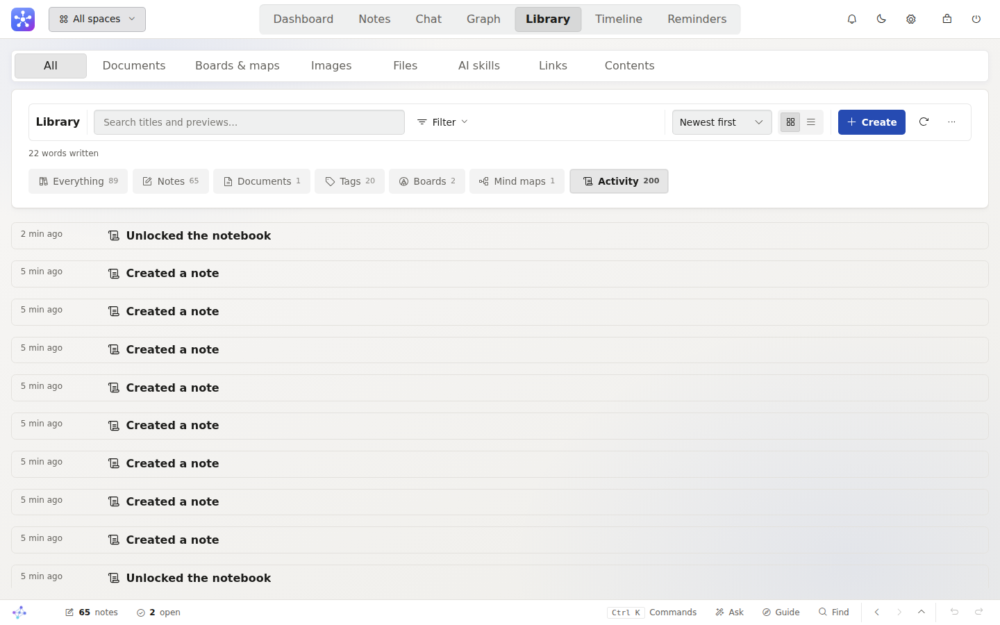
  <br><sub><b>Activity</b>: a record of what you did, one line each, in the Library beside what you made</sub>
</p>

<p align="center">
  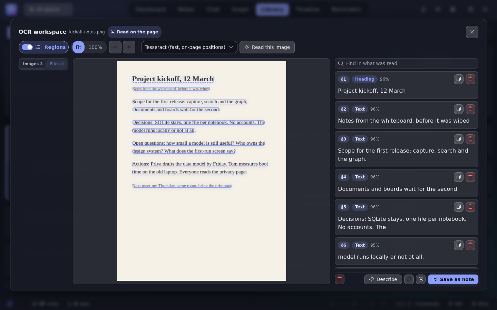
  <br><sub><b>OCR workspace</b>: a scanned page read locally, region by region, checkable and editable before it becomes a note</sub>
</p>

<p align="center">
  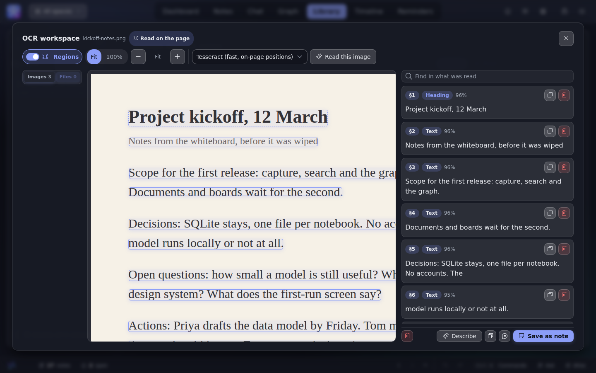
  <br><sub><b>Boards</b>: cards, drawings and images you arrange yourself</sub>
</p>

<p align="center">
  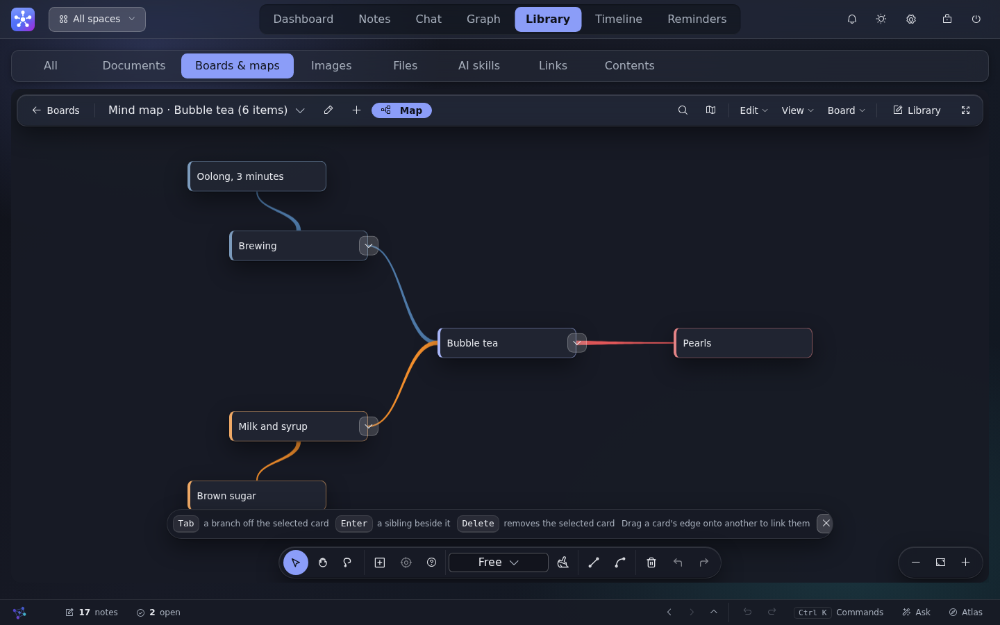
  <br><sub><b>Mind maps</b>: a branch with Tab, one beside it with Enter, core ideas told apart by shape, fill and size</sub>
</p>

<p align="center">
  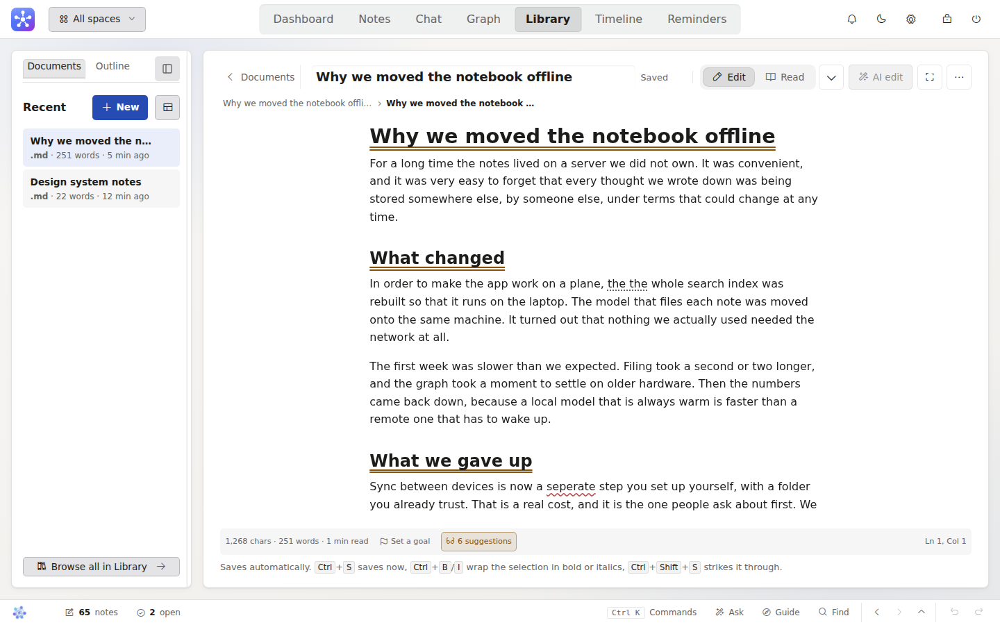
  <br><sub><b>Documents</b>: a long-form editor with four views, writing checks and full history</sub>
</p>

<p align="center">
  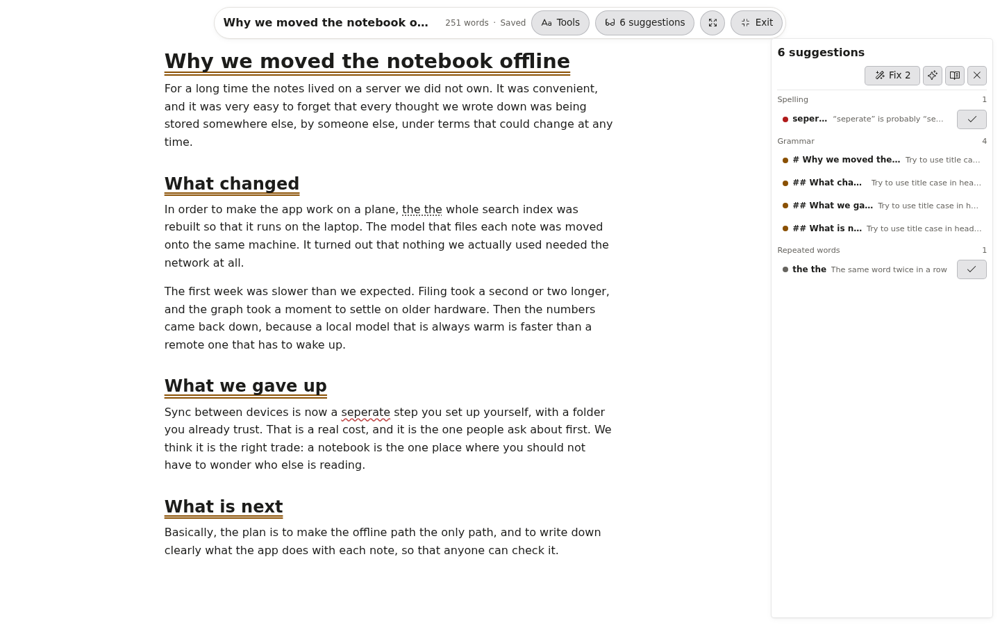
  <br><sub><b>Focus mode</b>: the page and nothing else, with the suggestions beside it when you want them</sub>
</p>

<p align="center">
  
  <br><sub><b>Timeline</b>: every note on a time axis</sub>
</p>

<p align="center">
  
  <br><sub><b>Reminders</b>: due dates linked to the note they came from</sub>
</p>

<p align="center">
  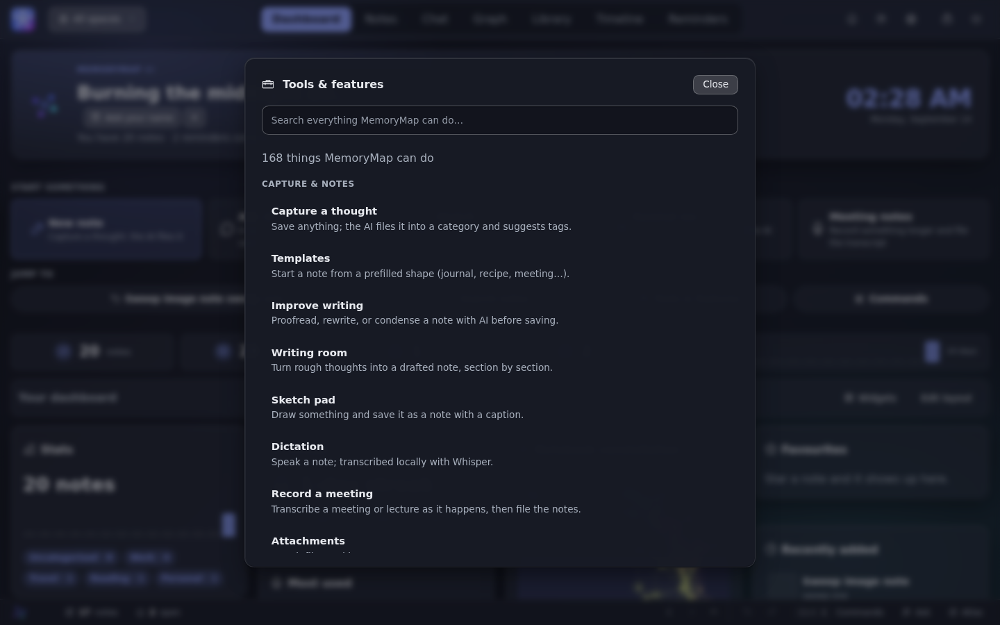
  <br><sub><b>Tools &amp; features</b>: everything the app can do, grouped and searchable</sub>
</p>

<p align="center">
  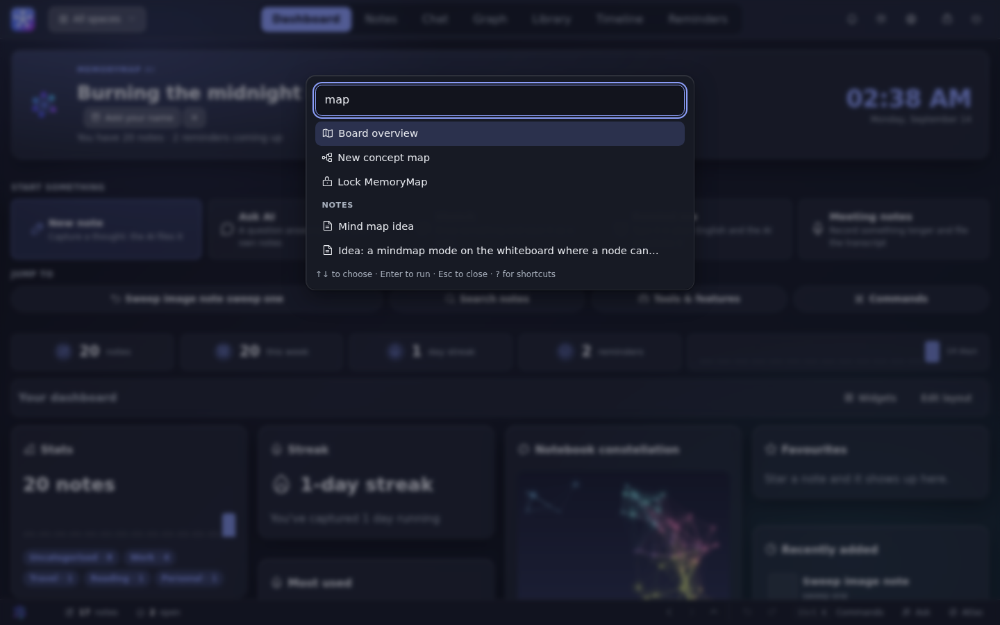
  <br><sub><b>Command palette</b>: Ctrl/⌘-K reaches a command, a note, a document, a file or a board</sub>
</p>

<p align="center">
  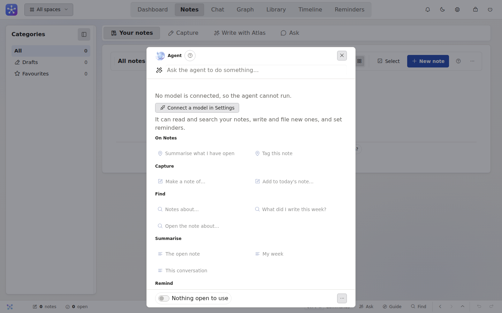
  <br><sub><b>Popup agent</b>: ask about your notes from any tab, with Atlas at the head of it</sub>
</p>

<p align="center">
  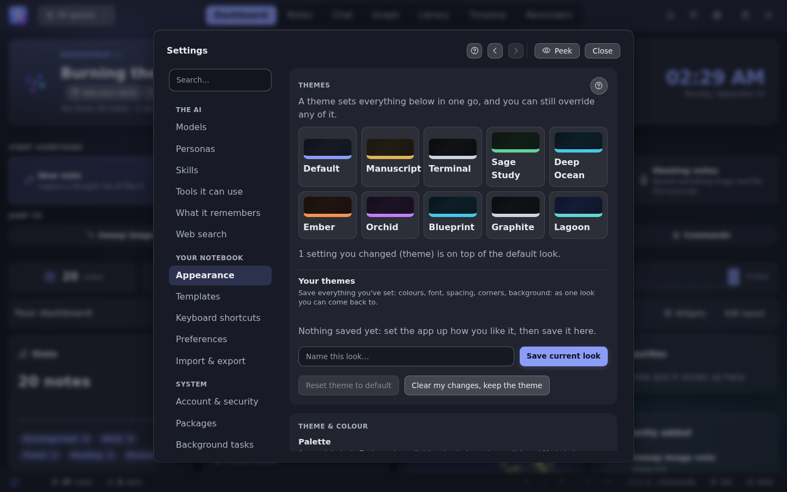
  <br><sub><b>Appearance</b>: thirteen themes, your own accent, type, density and corners</sub>
</p>

<p align="center">
  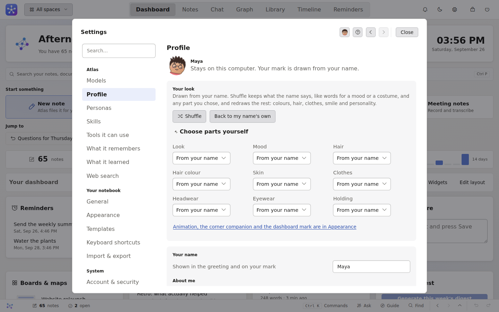
  <br><sub><b>Your look</b>: a face drawn from your name, and every part of it yours to choose</sub>
</p>

<p align="center">
  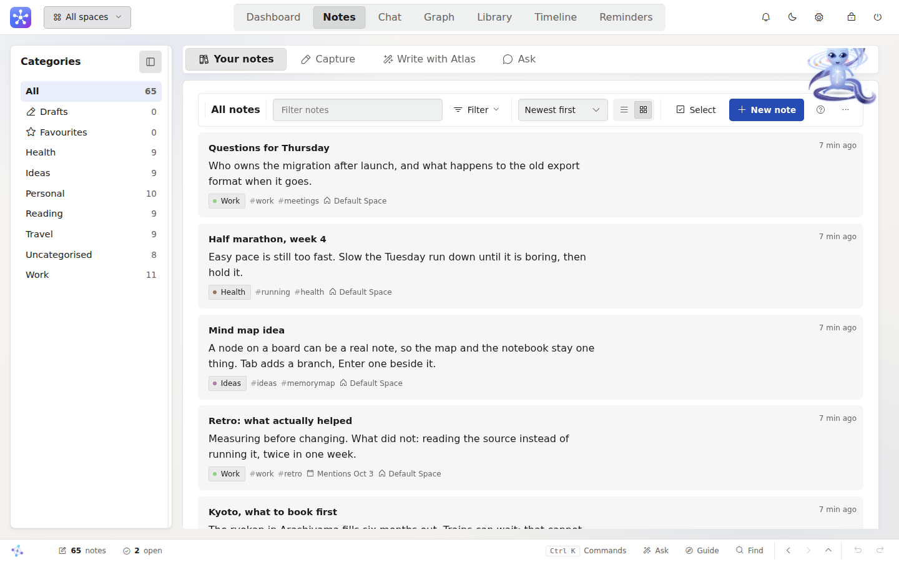
  <br><sub><b>The corner companion</b>: Atlas, you, a persona or a character of your own, perched on a panel and poked for a reaction</sub>
</p>

<p align="center">
  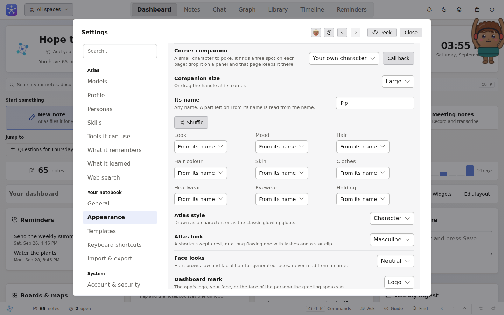
  <br><sub><b>A companion of your own</b>: any name, and the same parts as Your look</sub>
</p>

<p align="center">
  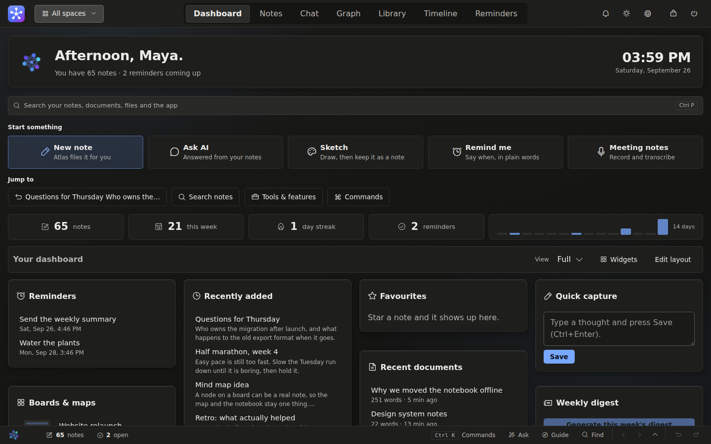
  <br><sub><b>Dark</b>: every theme has a light and a dark side, or follows your system</sub>
</p>

<p align="center">
  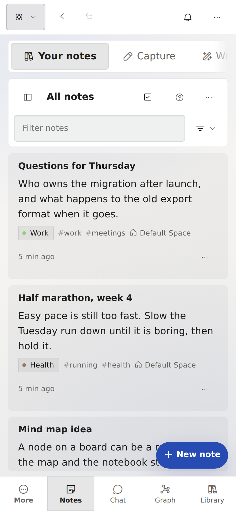
  <br><sub><b>On a phone</b>: one column, the tabs at your thumb</sub>
</p>

<p align="center">
  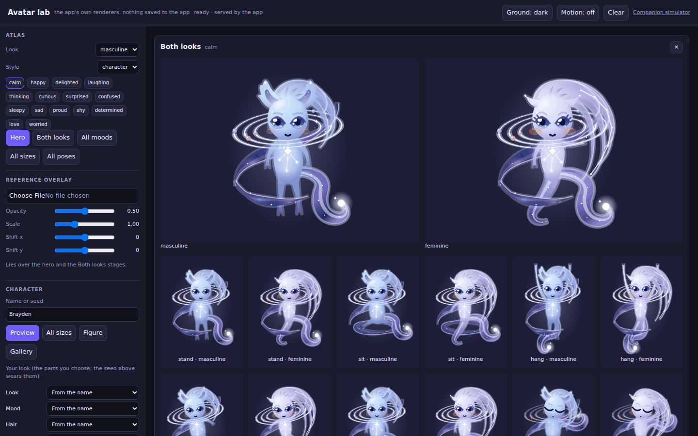
  <br><sub><b>The avatar lab</b> (<code>tools/avatar-lab.html</code>): the app's own renderers on one page, for tuning Atlas and the generated faces</sub>
</p>

</details>

## Contents

- [Get started](#get-started)
- [What it does](#what-it-does)
- [The AI, and life without it](#the-ai-and-life-without-it)
- [Your data](#your-data)
- [Documentation](#documentation)
- [Developing](#developing)
- [Status](#status)
- [Licence](#licence)

## Get started

Three ways in. None needs a terminal.

**Windows.** Download `MemoryMap-AI-Setup-*.exe` from the
[latest release](https://github.com/Braydenh563/MemoryMap-AI/releases/latest)
and run it. The app opens in its own window. An MSI
(`MemoryMap-AI-*-windows-x86_64.msi`) is also on that page, for a silent or
scripted install with `msiexec /quiet`.
[What the SmartScreen prompt means](docs/INSTALL.md#windows-installer).

**Linux.** Download `MemoryMap-AI-*-linux-x86_64.tar.gz` from the same page,
`tar -xzf` it and run `MemoryMap AI`. Needs GTK and WebKit (`python3-gi` and
`gir1.2-webkit2-4.1`, or your distribution's equivalent). A `.zip` of the
same build is there too, but prefer the tarball: a zip does not reliably
carry the executable bit, and some archive managers unpack the launcher
without it, which leaves you with a file that will not start and no
explanation.

**macOS, or from source on any platform.** Clone the repository and run
`./start-desktop.sh` (on Windows, double-click `start-desktop.bat`), or
`./start.sh` for a browser tab. The launcher builds a private Python
environment, installs everything and opens the app. `--doctor` on either
one checks the machine and prints a table with a fix per row. A
step-by-step version for first-time terminal users is in
[docs/INSTALL.md](docs/INSTALL.md).

Add the AI afterwards: install [Ollama](https://ollama.com) and pull a
model that fits your machine. Which one, from "runs on a laptop with no
GPU" upwards, is in [docs/MODELS.md](docs/MODELS.md). Any OpenAI-compatible
server works too: LM Studio, llama.cpp's `llama-server`, Jan, vLLM.

## What it does

**Capture.** Type, paste, dictate (local Whisper) or draw. The AI picks a
category by meaning, or asks you in guided mode, and says which. Free text
can be split into separate, auto-linked notes. Notes take Markdown inline,
including `[[wiki links]]`, `~~strikethrough~~` and `==highlights==` in
six colours.

**Ask.** A question returns a conversational answer and the notes behind
it, side by side, with each sentence linked to the note it came from. Chat
is saved and resumable. In Agent mode the assistant has 58 tools to
search, link, organise and act on your notebook; anything destructive
asks first, and every step it takes is shown.

**See the shape of it.** The Graph draws your notes as a map, coloured by
category and linked by meaning, with the reason for each link written
down. The Timeline puts every note on a time axis. The Dashboard shows
your capture streak, statistics, a weekly digest and whatever widgets you
choose.

**Write at length.** Documents is a long-form editor with Live, Source,
Split and Read views, a formatting toolbar, spelling and style checks you
can click on, version history, and code files with line numbers.

**Think on a canvas.** The Whiteboard holds sketches, shapes, images and
note cards on a pannable surface. A board can be a **mind map**: a root
topic with branches you grow by hand or from your notes, exportable as
Markdown or OPML.

**Keep everything in one Library.** Notes, documents, chats, files, tags,
bookmarks, the recycle bin and the activity log. Every image you add is
read three ways where each is available (a caption, a vision-model
transcription and Tesseract OCR), all editable, all searchable. Attach any
file to a chat message: images go to a vision model, and documents,
spreadsheets, PDFs and code are imported with their text extracted.
Scanned PDFs are read page by page by an OCR model.

**Remember.** Reminders with priority, repeats and snooze, or type "call
Sam tomorrow evening" and let the AI schedule it.

**Automate.** 20 built-in skills (and your own) run multi-step jobs over
the notebook as a visible checklist, one step at a time, with each tool
call shown. An optional background librarian tags, links and flags
duplicates on a schedule you set. It never deletes anything.

**Meet Atlas.** The notebook's guide is a character: a small star spirit
with two rings of stars about it and a tail of starlight, in a masculine or
a feminine look (or the classic glowing globe it started as). Atlas files
your notes, answers "how do I" questions from the app's own documentation
without ever reading your notes, and has moods: pleased when you save,
thinking while an answer is written, sleepy late at night.

<p align="center">
  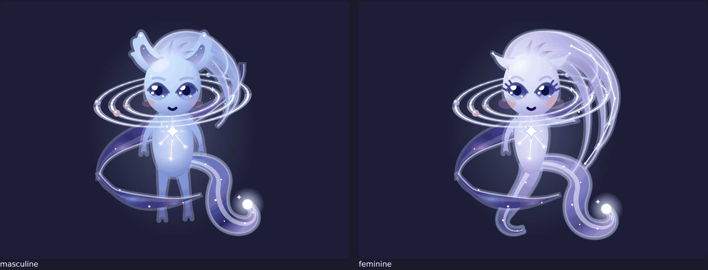
</p>

**A companion in the corner.** Atlas, your own face, the chat's persona or
a character you name yourself can live in the corner of every page. It finds
a free spot on its own, sits, stands, hangs or leans on any panel, toolbar or
card, and reacts to what happens: a saved note, an answer, a bell, a poke.
Drop it on a panel and that page keeps it there; small, medium, large or any
size from the handle at its corner.

<p align="center">
  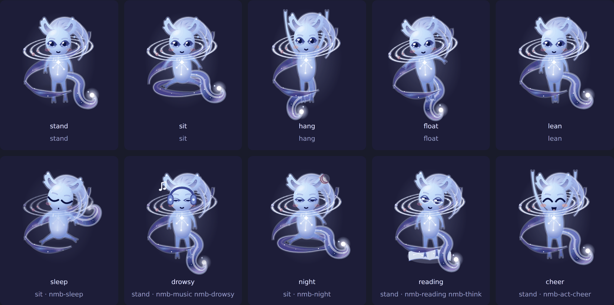
</p>

**Faces for everyone.** Every person and persona gets a small drawn
character read from their name (a mood word, an animal, a costume), and
Settings, Profile, Your look lets you shuffle yours or choose every part:
hair, skin, clothes, headwear, eyewear, what you hold. The avatar lab
(`tools/avatar-lab.html`, served at `/tools` when the app runs from a
source checkout) puts the app's own renderers
on one page, every mood, pose and size, for tuning them by eye.

**Sign in, or don't.** The notebook asks for its password when it opens, by
default. On a computer only you use, Settings, Account and security can turn
that off: the app opens straight in on this computer, another device on your
network still needs the password, and private notes stay encrypted until you
unlock them.

Also: a command palette (`Ctrl`/`Cmd`+`K`), a popup agent, read-aloud,
opt-in web search, thirteen themes, each in light or dark,
interface zoom, a guided tour of the real controls, and daily local backups.

## The AI, and life without it

MemoryMap is built around a local model, and built to work when there is
none. With no model running, notes are filed as Uncategorised, search
uses full-text matching with stemming and spelling correction, and every
other feature keeps working. A dot in the header always says what the AI
is doing.

- **Any local model.** Ollama by default; any OpenAI-compatible server by
  setting a URL. Settings > Models shows the sampling parameters and
  starts each at the value the model's own file recommends.
- **A model per feature, if you want one.** Chat, Write with Atlas, the
  documents assistant and the Guide each run on the chat model until you
  give one of them a model of its own, from Settings > Models or from that
  surface's own menu. One button hands them all back.
- **Small models are first-class.** Skills and tool use have a small-model
  mode that gives a 4B model one step and one tool at a time, with
  recovery when it skips a step.
- **Search by meaning** is optional and off by default. Turn it on and
  questions match ideas rather than words, using a local embedding model
  through Ollama.
- **Settings > Packages** installs the optional pieces from inside the app,
  none of them needed for the core: dictation (faster-whisper), the desktop
  window (pywebview), search by meaning (sentence-transformers), scanned PDFs
  (pypdfium2), document import (markitdown), Word export (python-docx), text
  in images (Tesseract OCR), running Python files (Pyodide), and tool calling
  with no model server running (needle, telemetry forced off). The last two
  are pinned downloads checked against a sha256, and work offline once
  installed.

## Your data

Everything lives in one folder: `memorymap.db` (your notes), `preferences.json`,
`uploads/` (attachments and sketches) and `backups/` (daily local
snapshots). Set `MEMORYMAP_DATA_DIR` to put it somewhere else. Export to
JSON, CSV or Markdown from Settings at any time.

Nothing leaves your machine unless you ask it to. The server binds to
localhost, the AI is confined to your own network, web search is off by
default and sends only your search words, and private notes are encrypted
at rest with a key derived from your password. The full model, including
session expiry, the CSRF and CSP protections and what to do if you forget
your password, is in [docs/PRIVACY.md](docs/PRIVACY.md). To report a
vulnerability, see [SECURITY.md](SECURITY.md).

## Documentation

| Document | What it answers |
| --- | --- |
| [INSTALL](docs/INSTALL.md) | The Windows installer, the launcher script, manual setup, updating and uninstalling |
| [MODELS](docs/MODELS.md) | Which model to pick for your machine, and using a backend other than Ollama |
| [PRIVACY](docs/PRIVACY.md) | What touches the network and when, private-note encryption, session security |
| [TROUBLESHOOTING](docs/TROUBLESHOOTING.md) | The common problems and their fixes |
| [ARCHITECTURE](docs/ARCHITECTURE.md) | How the pieces fit: request lifecycle, data model, the AI stack, where to change any given thing |
| [DESIGN](docs/DESIGN.md) | The design system every screen is written against |
| [ROADMAP](docs/ROADMAP.md) | What is open, in order, with the reasoning |
| [CHANGELOG](CHANGELOG.md) | What changed, release by release |
| [CONTRIBUTING](CONTRIBUTING.md) | Setup, tests and opening a pull request |
| [SECURITY](SECURITY.md) | How to report a vulnerability |

## Developing

```
pytest                          # 4,600+ tests, about ten minutes on four cores (-n auto), fully offline
bash scripts/gate.sh --changed  # the routine local gate: lints, node --check, ruff, the tests that name your files
ruff check .                    # what CI lints with
node --check frontend/app.js    # the frontend has no build step: check each file you touch
```

The frontend is about 45 plain scripts that share one global scope, loaded
in the order `frontend/index.html` lists them; the app's own code is
`app.js` and the 22 files after it, one 50,000-line file until 0.3.3.
[docs/ARCHITECTURE.md](docs/ARCHITECTURE.md) says how load order and the
lazily loaded tabs work.

Tests use a throwaway database and fake every AI call, so they need no
GPU, no model and no network. They also cannot see the interface, so a
frontend change is driven in a real browser before it is called done;
[docs/ARCHITECTURE.md](docs/ARCHITECTURE.md) says how.

```
src/memorymap/
  __main__.py     entry point: python -m memorymap [--desktop]
  core/           config, database and migrations, backups, logs, crypto
  entry/          notes: create, read, link, soft-delete, the audit log
  ai/             model clients, filing, the agent and its tools, skills, embeddings, voice
  search/         full-text and semantic search, opt-in web search
  api/            the FastAPI app, one router per feature
frontend/         plain HTML, CSS and JavaScript, served as-is, no bundler
tools/            the avatar lab and the companion simulator (source checkouts only)
tests/            pytest, every AI call faked
docs/             user documentation, architecture, design system, roadmap
```

Migrations are additive by default: a new column is added the next time
the app opens an older database. Alembic is wired in behind that for the
day a rename or drop is needed. CI runs ruff, CodeQL and the full suite on
Python 3.11 to 3.13 on every push.

## Status

Version 0.3.3. The core is built and stable: capture, chat with checkable
answers, the graph, documents, boards and mind maps, the OCR workspace,
private notes, themes, desktop packaging for Windows and Linux. This
release gives Atlas a body and a second look, puts a companion in the
corner of every page, draws a face for every person, makes signing in
optional on your own computer, and splits the frontend's one large script
into files you can find your way around. What comes next,
in order, is in [docs/ROADMAP.md](docs/ROADMAP.md); what changed is in
[CHANGELOG.md](CHANGELOG.md).

**The guided tour** points at the real controls, one card at a time, over a
dimmed page: the basics, writing a note, finding things, and the boards and
maps, whole or one section at a time from Settings, help and guide. It closes
whatever is open over the page before each step, becomes a sheet on a phone,
and can be left at any point with the X, Skip or Escape. Every step of every
section is walked at three window sizes by `scratchpad/ui-sweeps/tour.js`; a
window size or zoom level that sweep has not measured is the likeliest place
for it to misbehave, and nothing else in the app depends on it.

## Licence

[GNU Affero General Public License v3.0](LICENSE).

You may use, study, modify and share this, and anything built on it must
stay under the same licence, including a modified copy run as a network
service. That last clause is why the AGPL was chosen: MemoryMap is a
local-first app, and the licence keeps a closed, hosted version of it from
being offered back to the people it was written for.
